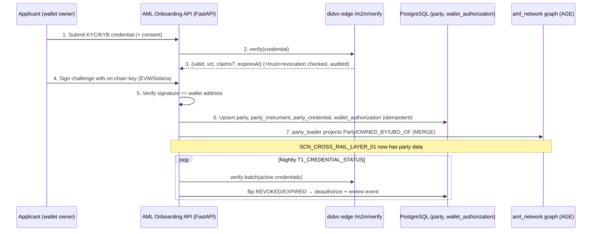

# Feasibility Study — DID/VC-Based Authorized Wallet Onboarding for Fiat & Stablecoin AML

| | |
|---|---|
| **Date** | 2026-09-03 |
| **Status** | Draft v1 — for review |
| **Question** | Can the `didvc/` W3C DID/Verifiable Credentials module be integrated into the Overwatch AML platform to onboard **authorized wallets** (fiat + stablecoin) whose owners have completed KYC/KYB, with verified identity feeding screening, risk scoring and detection? |
| **Related** | [AML_spec.md](../AML_spec.md) · [ADR-0001 Unified Detection Engine](adr/0001-unified-detection-engine.md) · [Typology Gap Plan 2026-07-10](../Implementation_Plan/20260710_typology_gap_plan.md) · [v5 Converged Data Model](new_v5_spec/aml_converged_data_model.md) · [v5 Build Specification](new_v5_spec/project_overwatch_development_specification.md) · [didvc README](../didvc/README.md) · [didvc Compliance Handbook](../didvc/docs/compliance-handbook.md) |

---

## 1. Executive Summary

**Verdict: FEASIBLE — with conditions.** The integration is technically sound, strategically coherent, and regulatorily defensible, but it is *not* turnkey. The credential-verification layer of `didvc` is substantially built and test-guarded; the missing pieces are a wallet-binding credential schema, a proof-of-address-control step, production hardening of the identity service, and a producer for the AML platform's existing-but-empty party/UBO dimension.

**What makes this feasible:**

1. **The AML platform already has the exact seam this fills.** The v5 build specification reserves an upstream *"KYC/KYB Provider — Webhook + REST pull — REST (OAuth2)"* integration slot (`docs/new_v5_spec/project_overwatch_development_specification.md` §1.3, §2.1), currently assumed to be Onfido/Jumio. `didvc` maps onto that seam 1:1 through its stateless machine-to-machine verification API (`POST /{tenant}/m2m/verify[-batch]`, API-key auth, sub-second p95 guarded in CI).
2. **The credential layer maps directly onto the use case.** Existing schema types `hkt_kyc_v1` (kycLevel, sanctionsClear), `hkt_licensed_institution_v1` / `hkt_corporate_v1` (KYB), and `hkt_agent_binding_v1` (public-key-hash binding with policy scope) cover individual KYC, business KYB, and — as a template — wallet binding. A new `hkt_wallet_binding_v1` schema follows the documented cookbook pattern.
3. **The party/UBO dimension is built and waiting for a producer.** `aml_platform/init-scripts/06-party-ubo-model.sql` + `aml_platform/etl/party_loader.py` were added in July 2026 specifically to unlock cross-rail layering detection (`SCN_CROSS_RAIL_LAYER_01` — "stablecoin inflow → fiat outflow, same beneficial owner"), but the tables ship with EXAMPLE seed rows and no onboarding process ever writes to them. The flagship rule silently skips for lack of Party data. DID/VC-based onboarding is precisely the missing producer.
4. **Trust, revocation and audit semantics match AML needs.** Per-tenant issuer trust registry, Bitstring Status List revocation checked on every verification (kill-switch semantics), hash-chained audit logs on both sides, and a two-custodian split-knowledge re-identification flow that aligns with legal-process requirements.

**Conditions (must-close gaps):**

| # | Gap | Severity |
|---|-----|----------|
| G1 | No proof of **wallet-address control** anywhere in `didvc` (no did:pkh, no EIP-4361/SIWE-style signature-over-address). A credential can assert "person X passed KYC" but cannot today prove "person X controls address 0xabc…". | **Blocker for Phase 2** |
| G2 | No **wallet-binding credential schema** — must be authored (`hkt_wallet_binding_v1`) and admitted to the schema whitelist. | Required, low effort |
| G3 | `didvc` **cannot be built from this repo copy** (parents to `unomi-root:3.1.0-SNAPSHOT`; Unomi root tree, `bom/`, `itests/`, docker dev stack absent). Needs the full Unomi tree or a standalone edge deployment. | **Blocker for build/integration** |
| G4 | Production hardening: open security findings (F-7/F-8/F-10/F-12), no third-party pen test, in-memory wallet/nonce stores, `ldp_vc` is JWS-wrapped rather than true Data-Integrity proofs, Tron/Solana/Aptos chain adapters are stubs. | **Blocker for production**, not for pilot |
| G5 | Regulatory framing: an "allow-list" must never bypass controls. HKMA's risk-based language requires authorized-wallet status to be **one risk input among many**, with documented rationale, expiry, revocation and re-verification — all of which the credential model natively provides. | Design constraint |

**Recommended approach (Option C — hybrid):** treat `didvc` as the upstream KYC/KYB verification provider at the reserved v5 seam, using M2M verify at onboarding time plus a new wallet-binding credential carrying a hashed wallet address and custody type; write verification outcomes into the party dimension (`party`, `party_instrument` / v5 `party_wallet`, `account`); feed the resulting signals into screening, risk scoring, and capability-gated detection scenarios in the `aml_detection` registry. Phase it: M2M gate first (no `didvc` code changes needed), wallet-binding credential + address-control proof second, production hardening in parallel.

---

## 2. Background, Objectives & Scope

### 2.1 The authorized-wallet concept

"Authorized wallet" in this study means: a fiat account or stablecoin/crypto wallet whose controlling party (natural person via KYC, or legal entity/UBO chain via KYB) has been verified by an accredited issuer, holds a machine-verifiable credential attesting to that verification, and whose authorization remains **revocable and time-bounded**. The AML platform would consume this attestation to:

- attribute otherwise pseudonymous wallet addresses to KYC'd/UBO-resolved parties,
- enrich risk scoring with verification level, jurisdiction, custody type and issuer,
- modulate (never eliminate) monitoring intensity for verified counterparties,
- provide evidentiary audit of *why* a wallet was treated as authorized.

### 2.2 The two systems being joined

| | Overwatch AML Platform | unomi-did-vc (`didvc/`) |
|---|---|---|
| Purpose | Transaction monitoring, screening, alert/case/STR workflow for fiat + stablecoin | W3C DID / Verifiable Credentials identity layer (HKT Trusted-Identity CDP) on Apache Unomi |
| Stack | Python 3.12 / FastAPI, PostgreSQL 16 + Apache AGE, Next.js, Dagster, Keycloak, Flowable | Java / OSGi (Karaf), Spring Boot edge, Maven multi-module |
| Integration mode | — | **Cross-system REST only** (no shared code; different runtimes) |

There is currently **zero coupling** between them: an exhaustive search of AML-side docs finds no mention of DID, verifiable credentials, decentralized identity, Unomi, or HKT-as-company (every "HKT" hit is the timezone). `didvc` was dropped into this repo as a self-contained guest module. The strategic bridge is corporate: the platform is being built for the distribution of **AnchorPoint (SCB × HKT × Animoca Brands JV)** HKDR stablecoin and USDC across EVM chains and Solana (`docs/new_v5_spec/doc_full.md`), and `didvc` is the HKT Trusted-Identity CDP — the same group. Sourcing wallet identity from the in-group CDP is strategically coherent even though no document says so yet.

### 2.3 Scope

**In scope:** feasibility of credential-based authorized-wallet onboarding — technical capability mapping, gap analysis, integration architecture options, data-model impact, regulatory considerations, security/privacy, risks, phased roadmap.

**Out of scope:** implementing the integration (this study precedes an ADR + Implementation Plan per repo convention — Lesson 1, spec-first); on-chain screening/analytics (TRM/Chainalysis adapter — separate workstream per the gap plan Phase 3); the Travel Rule message exchange itself (Notabene TRP gateway in the v5 design); modifying Unomi core.

---

## 3. Current-State Assessment

### 3.1 The AML platform: wallets are pseudonymous with zero KYC linkage

There are **two parallel detection systems** in the repo (explicitly acknowledged in `etl/detection.py`):

1. **`aml_platform/` (v2/v5 platform)** — fiat SWIFT + crypto/stablecoin staging → OFAC gate → `aml_network` AGE graph → Cypher rule engine. Schemas in `aml_platform/init-scripts/01..06-*.sql`; loaders/engines in `aml_platform/etl/`.
2. **`etl/` (Dagster "tap_and_go" pipeline)** — HK SVF-style fiat CSV → `core.*` tables → `tap_and_go_network` graph → its own detection job. This is the pipeline wired into `aml_platform/docker-compose.yml` and served by the deployed FastAPI backend.

The two are unified only at the abstract-registry level by the root `aml_detection/` package (ADR-0001).

**How a wallet enters the system today:** a bare string in `staging_crypto_raw.sender_wallet / receiver_wallet` (`aml_platform/init-scripts/01-init.sql`), promoted by `aml_platform/etl/graph_loader.py` into `(:Entity {id: '<address>', system: 'ETHEREUM'|…})`. Node properties are only `{id, system}` — stated verbatim in `aml_platform/etl/scenarios.py`: *"There is currently NO beneficial-owner / party dimension on nodes."*

**The party dimension exists but has no producer** (`aml_platform/init-scripts/06-party-ubo-model.sql`):

- `party(party_id, party_type NATURAL|LEGAL, kyc_status PENDING|VERIFIED|ENHANCED, risk_rating, jurisdiction, expected_txn_profile)`
- `party_instrument(instrument_id → Entity.id, instrument_type FIAT_ACCOUNT|CRYPTO_WALLET, party_id, ownership_pct, valid_from/to)` — comment: *"Maintained by KYC/onboarding"*; ships with EXAMPLE seed rows only
- `party_ubo(subject_party_id, ubo_party_id, ownership_pct, control_role)`
- `aml_platform/etl/party_loader.py` projects `(:Party)` + `OWNED_BY` / `UBO_OF` edges — but only from whatever rows sit in those tables.

Consequence: `SCN_CROSS_RAIL_LAYER_01` (stablecoin inflow → fiat outflow within 48h, same UBO — the platform's stated reason for existing) **gracefully skips** unless the `Party` label exists (`requires_labels` gating). There is no onboarding process, no API, no UI, and no data producer for any of it.

**Screening is deny-list only:** stored procedure `sp_screen_ofac()` (`aml_platform/init-scripts/02-regulatory-procedures.sql`) does exact-match joins — fiat accounts vs `ofac_blocklist.entity_id`, crypto wallets vs `ofac_blocklist.wallet_address` — sinks CRITICAL alerts, then flips staging rows `PENDING → SCREENED` (pre-graph regulatory gate). The blocklist is never populated from any feed. No fuzzy matching, no PEP/adverse media, no concept of a *verified, lower-risk* counterparty. The frontend `ScreeningModule.tsx` renders hardcoded mock data.

**Risk scoring does not exist:** `app.alerts.risk_score` is never written; the UI fakes it from transaction amount; `party.risk_rating` is static seed text consumed by nothing.

**Identity-adjacent plumbing that does work and must be respected by any new capability:**

- Dual-track auth (local JWT HS256 + Keycloak 26.0 provisioning; roles `JUNIOR_ANALYST | SENIOR_INVESTIGATOR | DEPARTMENT_HEAD | ADMIN`), scopes `alert.read` / `graph.explore` (`aml_platform/backend/app/core/auth.py`).
- PII masking service (`aml_platform/backend/app/services/pii_service.py`): `wallet_address` is a masked field (only `SENIOR_INVESTIGATOR` sees raw values; every unmask logs a `PII_UNMASKED` audit event).
- Row-level security: `app.tenants` + RLS policies on alerts/cases/STRs keyed to `app.current_tenant`.
- Append-only hash-chained `app.audit_access_events` (`aml_platform/backend/init_scripts/02_audit_tamper_evidence.sql`).
- Flowable BPMN maker-checker case workflow (`aml_case_workflow.bpmn20.xml`).

### 3.2 The didvc module: substantially built, privacy-engineered, test-guarded

Per `didvc/README.md` and source inspection (217 tests: api 8, sd-jwt 22, metering 13, services 122, rest 3, edge 47, gateway 5):

**DID layer**

| Capability | Status | Notes |
|---|---|---|
| did:web create/resolve/rotate/deactivate | Implemented | `DidServiceImpl`; published at `GET /.well-known/did.json` |
| did:key | Implemented | Ed25519 `z6Mk…` derivation, RFC 8032 vectors |
| Universal Resolver HTTP drivers | Implemented (inactive until configured) | For **iAM Smart / RealDID** — HK's government digital ID |
| EVM DID anchoring | Demo-grade | `EvmChainAdapter` `DidAnchorRegistry` ABI; real testnet RPC is ops wiring; built-in simulated connection |
| Tron / Solana / Aptos adapters | **Stubs** (throw `UnsupportedOperationException`) | `PlannedChainAdapters.java` — note Solana is in AnchorPoint's distribution scope |
| did:pkh / EOA-derived DIDs | **Absent** | Anchors issuer DIDs; does not resolve wallet-derived identities |

**Credential layer**

| Capability | Status | Notes |
|---|---|---|
| SD-JWT VC (RFC 9901) | Implemented | Default format; `didvc-sd-jwt` module; selective disclosure per claim; RFC test vectors |
| JSON-LD `ldp_vc` | Partial | VC DM 2.0 document but JWS-wrapped; true Data-Integrity proofs are a stated follow-up |
| Key binding | Implemented | `cnf.jwk` at issuance, rebind endpoint; KB-JWT verification (nonce, aud, sd_hash) |
| Revocation | Implemented | W3C Bitstring Status List v1.0 + StatusList2021 adapter; **checked on every verification** |
| Consent gating | Implemented | Disclosure requires a `didvc-consent-grant` (subject × schema × verifier category) |
| Refresh | Implemented | Sweep marks credentials refresh-due 90 days pre-expiry or on identity change |

**Existing credential schemas** (claim whitelist enforced at issuance — the structural privacy gate):

| Schema (vct) | Use | Key claims |
|---|---|---|
| `hkt_kyc_v1` | Individual KYC | **kycLevel\***, **sanctionsClear\***, givenName, nationality (selective) |
| `hkt_licensed_institution_v1` | KYB — regulated entity | **licenseClass\***, **regulated\***, **licenseValidUntil\*** |
| `hkt_corporate_v1` | KYB — corporate registry | **registrationNoHash\***, **jurisdiction\***, **licensedActivities\***, lei |
| `hkt_realname_v1` | Real-name verification | realNameVerified |
| `hkt_agent_binding_v1` | Agent/software key binding | **agentPubKeyHash\***, **principalBindingLevel\***, policyScope |
| `hkt_profcred_v1` / `hkt_residency_v1` / `hkt_cargo_v1` | Professional / residency / cargo | (not directly relevant) |

Arbitrary new schemas via `POST /didvc/schemas`.

**Trust & privacy model**

- **TrustRegistryService** — per relying-tenant × issuer DID × vct × accreditation level × validity window; `isTrusted()` runs on *every* verification. (Implementation note: full-collection scan per check — fine at pilot scale, needs indexing later.)
- **PairwiseBindingService** — per-verifier opaque pseudonyms (`didvc:pairwise:<random>`); reverse mapping deliberately not exposed via REST.
- **SplitKnowledgeService** — re-identification of a pairwise reference requires a legal-process-justified request plus approvals from **two distinct custodians**; resolution succeeds exactly once; every step appended to the audit trail.

**Verification surface (`didvc-edge`, Spring Boot)** — the AML-relevant endpoints:

| Endpoint | Auth | Relevance |
|---|---|---|
| `POST /{tenant}/m2m/verify` and `/m2m/verify-batch` | `X-Api-Key` (+ assumed mTLS) | **Primary integration point.** Stateless; returns `{valid, vct, expiresAt[, reason][, claims]}`; per-record audit `didvcM2mVerified`; sub-second p95 asserted as a CI regression guard |
| `POST /{tenant}/vp/authorize` + `/direct_post` (OID4VP) | Nonces, JWKS-signed request objects | Full wallet-presented verification; DCQL claim pinning; `claim_level_response` zero-PII mode |
| OID4VCI issuer (both grants, PKCE, DPoP) | OAuth2 | Credential issuance to holders/wallets |
| `POST /{tenant}/agents/admit` + per-call re-verification | API-key + credential | Kill-switch admission pattern directly analogous to authorized-wallet admission |
| `GET /{tenant}/status-lists/{id}` | Public | Fetchable signed status lists |
| Platform REST (`/didvc/*` on Karaf:8181) | `@RequiresRole(ADMINISTRATOR)` | DIDs, credentials, schemas, trust-entries, trust-check, consent-grants |

**Operational qualities:** multi-tenant by URL segment and item tenancy; Kafka metering sink (topic `didvc-metering`); SHA-256 hash-chained audit log with JDBC store (`didvc_audit_log`); HSM via `Pkcs11KeyMaterialProvider` (SunPKCS11, private keys never in app memory; EdDSA/ES256 only); third-party interop proven via OpenWallet Foundation `@openid4vc` round-trip (`didvc/interop/wallet-roundtrip.ts`).

### 3.3 Candid maturity summary

| Area | State |
|---|---|
| Credential issuance & verification (SD-JWT) | Production-shaped, test-guarded |
| Revocation, trust registry, consent, pairwise, split-knowledge, audit, HSM | Implemented; scale/perf hardening pending (in-memory stores, registry scan) |
| Wallet-native identity (address control, did:pkh, multi-chain) | **Absent / stubbed** |
| Security posture | Open findings F-7 (no redirect_uri/client_id allow-list), F-8 (proof `aud` not validated), F-9 (non-constant-time key compare), F-10 (unbounded in-memory maps), F-12 (open redirect); **no third-party pen test** (`didvc/docs/security-review.md`) |
| Buildability | **Not buildable from this repo copy** — needs full Unomi 3.1.0 tree |
| AML platform side | Party dimension built but unpopulated; screening deny-list-only; no risk engine; substantial demo-grade hardcoding (localhost DSNs, anonymous-auth fallback, mock screening UI) |

---

## 4. Regulatory & Compliance Feasibility

The platform's regulatory basis (`docs/new_v5_spec/Project-Overwatch-Full-Requirements-Specification.md` §3): **AMLO Cap.615** (Sch.2 s.2 CDD ≥ HKD 8,000; s.10 EDD/PEP; s.13A Travel Rule; s.25A tipping-off; 6-year retention), **Stablecoins Ordinance Cap.656** (effective 1 Aug 2025 — licensed issuers are FIs; CDD for custodial **and unhosted** wallets at/above HKD 8,000; enhanced monitoring of unhosted transfers; blacklisting/freezing duty), **FATF R.15/16** (June 2025 plenary: beneficiary verification now a requirement), **JFIU STREAMS 2** reporting, HKMA expectations of ongoing blockchain-analytics wallet screening.

### 4.1 Where DID/VC authorized wallets fit — and where they must NOT

**Fits:**

- **Reusable KYC/KYB attestations.** The didvc compliance handbook already positions reusable KYC under HK AMLO: a credential from an accredited issuer is *evidence supporting* CDD, consumed with documented rationale. `party.onboarding_channel` in the v5 converged model already enumerates `iAM_SMART` — and didvc ships a Universal-Resolver driver for iAM Smart/RealDID, so government-ID-anchored credentials are natively resolvable.
- **Cap.656 counterparty diligence.** "Enhanced monitoring for transfers to/from unhosted wallets" cuts both ways: a **hosted wallet at a licensed issuer with a valid KYB credential** (`hkt_licensed_institution_v1`: licenseClass, licenseValidUntil) is exactly the evidence a stablecoin issuer needs to apply standard rather than enhanced treatment for counterparty VASPs. The v5 design already prescribes "VASP counterparty due diligence against VASP registries" (`Project-Overwatch-Next-Generation-of-Transaction-Monitoring.md` §3.2.1) — a credential-fed trust registry is a mechanization of that requirement.
- **Evidentiary trail.** Every verification appends an audit record to the hash-chained log on the didvc side; the AML side has its own `app.audit_access_events` chain plus the v5 forensic-audit service (WORM, per-record hash chain). "Why was this wallet authorized?" is answerable with signatures, timestamps, issuer identity, and revocation status at the time of each check.
- **6-year retention & STR support.** Credential verification events, evidence hashes and issuer references can be retained per AMLO; STR `subject_background` and case customer-360 panels gain a machine-verifiable identity source instead of analyst-typed free text.

**Must not:**

- **An allow-list must never bypass controls.** No existing doc prescribes wallet whitelisting — all lists are blocklists (OFAC, Cap.656 blacklisting, `watchlist_entry`). HKMA's risk-based language and the README's own principle ("an alert should only be cleared when the institution is satisfied the abnormality can be explained, and the rationale must be documented alert by alert") mean authorized-wallet status must be **one input into risk scoring and triage priority — never a monitoring exemption**. Recommended framing everywhere: *verified-identity risk signal*, with:
  - time-bounded validity (credential `expiresAt` + refresh-due semantics),
  - revocation kill-switch (status list checked per verification),
  - re-verification on list updates (batch re-screen pattern already prescribed for sanctions lists),
  - sanctions screening still applied independently — `sanctionsClear` in a credential is an attestation *at issuance time*, not a substitute for ongoing screening.
- **Pairwise pseudonymity vs CDD instincts.** By design, verifiers cannot correlate subjects across relying parties. For AML, the credential should be treated as an *input to* (not replacement for) the institution's own CDD record; beneficial-owner resolution behind a pairwise reference is deliberately manual (split-knowledge, two custodians, legal process). This is workable — and privacy-enhancing under PDPO — but the workflow design must not assume the AML platform can silently unmask.

### 4.2 Privacy

Selective disclosure (salted SD-JWT digests), zero-PII `claim_level_response` mode, consent-gated disclosures, pairwise pseudonyms, and hashed identifiers in schemas (`registrationNoHash`, `agentPubKeyHash`) give strong PDPO alignment. The AML side already masks `wallet_address` by role and logs every unmask — the same treatment must extend to any credential claims surfaced in the UI/API.

**Regulatory feasibility: PASS**, conditional on the verified-identity-risk-signal framing and independent ongoing screening.

---

## 5. Capability Mapping & Gap Analysis

| # | Required capability (authorized-wallet onboarding) | didvc today | AML platform today | Verdict |
|---|---|---|---|---|
| C1 | Machine-verifiable KYC attestation for individuals | ✅ `hkt_kyc_v1` (kycLevel, sanctionsClear) | ❌ `party.kyc_status` column, no producer | **Ready** |
| C2 | Machine-verifiable KYB attestation for entities/UBO | ✅ `hkt_licensed_institution_v1`, `hkt_corporate_v1` | ⚠️ `party_ubo` table, no producer | **Ready** |
| C3 | Stateless server-to-server verification | ✅ `POST /{tenant}/m2m/verify[-batch]`, API-key, sub-second p95 | ❌ no identity provider integration (seam reserved in v5 spec) | **Ready** |
| C4 | Issuer trust management | ✅ TrustRegistryService + `/didvc/trust-check` on every verification | ❌ no trust concept | **Ready** |
| C5 | Revocation / kill-switch | ✅ Bitstring Status List, checked per verification | ❌ none | **Ready** |
| C6 | Bind a credential to a specific wallet address | ⚠️ Template exists (`hkt_agent_binding_v1` binds a key hash) but **no wallet schema, no address type** | ⚠️ `party_wallet` (v5 spec) has only `is_verified` + micro-transaction `verification_tx` | **Gap G2** — new schema |
| C7 | Prove the credential subject *controls* the address | ❌ No did:pkh / SIWE / signature-over-address | ❌ only micro-transaction ref in spec | **Gap G1** — new step |
| C8 | Chain coverage (EVM, Solana for AnchorPoint scope) | ⚠️ EVM demo-grade; Solana/Tron/Aptos stubs | n/a (off-chain) | Partial — address-control proof is chain-generic (message signature), anchoring is not needed for this use case |
| C9 | Persist authorization state in the AML data model | n/a | ⚠️ `party`/`party_instrument` built, empty; v5 `party_wallet`/`account`/`account_party_link` designed | **Design exists** — needs credential columns |
| C10 | Feed screening / scoring / detection | n/a | ⚠️ pre-graph gate exists (`sp_screen_ofac`); no risk engine; detection is capability-gated (`aml_detection`) | **Design needed** (see §6.4) |
| C11 | Evidence & audit | ✅ hash-chained, per-verification | ✅ `app.audit_access_events` + v5 forensic service | **Ready** |
| C12 | Deployable / buildable integration | ❌ **this repo copy can't build it**; demo profile is in-memory | ✅ docker-compose stack runs | **Gap G3** |
| C13 | Production security posture | ⚠️ F-7/F-8/F-10/F-12 open; no pen test | ⚠️ demo-grade auth hardcoding (todo.md P0) | **Gap G4** — both sides |

**Net:** the credential/trust/verification layer (C1–C5, C11) is ready now. The wallet-specific layer (C6–C8) is a bounded build inside didvc's own documented extension patterns. The AML-side consumption layer (C9–C10) is designed-but-unbuilt regardless of DID/VC — this integration is simply the first real producer it gets. G3/G4 are operational preconditions, not design risks.

---

## 6. Integration Architecture Options

All options assume cross-system REST (Java/OSGi ↔ Python/FastAPI); no shared code.

### Option A — didvc as upstream KYC/KYB verification provider (M2M only)

The v5 build spec already reserves this exact seam ("KYC/KYB Provider — upstream — webhook + REST pull"), and §1.3 explicitly scopes KYC/KYB verification *out* of the platform. `didvc` replaces/augments the Onfido/Jumio assumption.

**Flow:** onboarding workflow (web or back-office) submits the customer's existing credential (obtained out-of-band from an accredited issuer) → AML backend calls `POST /{tenant}/m2m/verify` → on `valid`, writes `party` + `party_instrument` (+ `kyc_status` from `kycLevel`, jurisdiction, risk inputs) → `party_loader.py` projects `Party`/`OWNED_BY`/`UBO_OF` → cross-rail detection activates.

- ✅ Zero didvc code changes; pure REST consumption; lowest cost; unlocks the party dimension immediately.
- ✅ Trust registry decides which issuers the platform honors — one admin surface.
- ❌ Does not itself prove address control (relies on the issuer's binding claim, if any).
- ❌ Batch re-verification (revocation drift between checks) needs a scheduled job.

### Option B — Full wallet-presented credentials (OID4VP at onboarding)

Holder's wallet presents KYC + binding credentials via `POST /{tenant}/vp/authorize` / `direct_post` with DCQL; AML platform acts as a relying party; nonce/JWKS/aud handling done by the edge.

- ✅ Strongest holder binding (KB-JWT proves wallet-key possession); zero-PII claim-level mode fits PII-masking policy.
- ❌ Requires holder wallet ecosystem + OID4VP client in the onboarding UX; heavier; overkill for B2B/KYB counterparties.
- ❌ Still doesn't prove *blockchain address* control (wallet keys here are the credential wallet, not necessarily the on-chain wallet).

### Option C — Hybrid (recommended)

1. **Onboarding-time:** M2M verify of KYC/KYB credentials (Option A) **plus** a self-sovereign **address-control proof performed by the AML platform itself**: the applicant signs a platform-issued challenge (EIP-191 personal_sign for EVM, equivalent message-sign for Solana) with the on-chain wallet key; the platform verifies the signature against the address and records it (this generalizes the v5 spec's micro-transaction `verification_tx` idea to an instant, chain-generic signature check).
2. **Binding issuance:** the platform (or the accredited issuer) issues/records a **`hkt_wallet_binding_v1`** credential binding subject DID ↔ address hash ↔ custody type (§7). Verification of that credential via M2M becomes the recurring authorization check.
3. **Ongoing:** nightly `T1_CREDENTIAL_STATUS` batch job re-verifies all active bindings (`/m2m/verify-batch`), mirroring the sanctions-list re-screen pattern; revocation or expiry flips the wallet to unauthorized and raises a review event.

- ✅ Covers G1 without waiting for didvc to grow did:pkh.
- ✅ Progressive: Phase 1 is pure Option A; C-step-2 arrives with the schema; C-step-3 with the batch job.
- ✅ Keeps HKMA-friendly properties: bounded validity, revocability, documented rationale.

**Options comparison**

| Criterion | A | B | C |
|---|---|---|---|
| didvc code changes | none | none | + schema (G2) |
| Proves address control | ❌ | ❌ | ✅ |
| Holder wallet ecosystem needed | no | yes | no |
| Effort to first value | lowest | high | medium (phased) |
| Revocation freshness | batch | per-presentation | batch + per-onboarding |

### 6.1 Data-model impact (AML side)

Extend — do not replace — the existing party dimension (and align with v5 converged model so the future migration is mechanical):

```sql
-- aml_platform (v2), alongside 06-party-ubo-model.sql
ALTER TABLE party ADD COLUMN IF NOT EXISTS did VARCHAR(255);           -- subject DID from the credential
ALTER TABLE party ADD COLUMN IF NOT EXISTS onboarding_channel VARCHAR(30);  -- VC_ISSUER | iAM_SMART | ... (v5 enum already reserves iAM_SMART)

CREATE TABLE party_credential (
    credential_id     VARCHAR(255) PRIMARY KEY,   -- platform-side reference (not the raw credential)
    party_id          VARCHAR(255) NOT NULL REFERENCES party(party_id),
    vct               VARCHAR(100) NOT NULL,      -- hkt_kyc_v1 | hkt_licensed_institution_v1 | hkt_wallet_binding_v1 ...
    issuer_did        VARCHAR(255) NOT NULL,
    verified_at       TIMESTAMPTZ NOT NULL,
    expires_at        TIMESTAMPTZ,                -- from credential
    status            VARCHAR(20) NOT NULL DEFAULT 'ACTIVE',  -- ACTIVE | EXPIRED | REVOKED | REFRESH_DUE
    evidence_hash     VARCHAR(128),               -- hash of verification response (audit/evidentiary)
    last_checked_at   TIMESTAMPTZ,
    UNIQUE (party_id, vct, issuer_did)
);

CREATE TABLE wallet_authorization (           -- the "authorized wallet" registry (denormalized view for gate/scoring)
    instrument_id     VARCHAR(255) PRIMARY KEY,    -- == Entity.id == party_instrument.instrument_id
    blockchain        VARCHAR(30) NOT NULL,
    wallet_address    VARCHAR(255) NOT NULL,
    address_proof     VARCHAR(20) NOT NULL,        -- SIGNATURE | MICRO_TX | ISSUER_ATTESTED
    proof_ref         VARCHAR(255),                -- challenge sig digest / tx ref
    custody_type      VARCHAR(20),                 -- HOSTED | UNHOSTED | EXCHANGE_CUSTODIED | MULTI_SIG (v5 enum)
    binding_credential VARCHAR(255) REFERENCES party_credential(credential_id),
    authorized        BOOLEAN NOT NULL DEFAULT FALSE,
    authorized_from   TIMESTAMPTZ,
    authorized_until  TIMESTAMPTZ,                 -- min(credential expiry, policy cap)
    UNIQUE (blockchain, wallet_address)
);
```

Idempotency per Lesson 3: `ON CONFLICT DO NOTHING` upserts keyed on `(blockchain, wallet_address)` and `(party_id, vct, issuer_did)`; graph promotion via `MERGE` (already the loader convention). v5 alignment: these columns project naturally onto `aml_core.account` (`blockchain_address`, `wallet_custody_type`), `account_party_link`, and `party_wallet` — add `did`/credential references there when the converged model lands.

### 6.2 Enforcement points (where authorization is consumed)

1. **Pre-graph screening gate** (where `sp_screen_ofac` runs, `aml_platform/etl/run_batch.py`): `wallet_authorization` is a new positive/negative input — *revoked* credential → internal blocklist feed (new alert type), exactly the Cap.656 blacklisting pattern; *authorized + valid* → attach authorization metadata to staging rows for downstream scoring. Screening itself still runs unconditionally.
2. **Risk scoring** (engine TBD, spec'd in v5 as `aml_alert.risk_score` / B.2.3 risk-scoring-service): verification level, issuer accreditation, custody type, jurisdiction, days-to-expiry and revocation history become counterparty-risk factors; authorization modulates alert *priority*, never suppresses typology execution.
3. **Detection** (per ADR-0001 — abstract registry, capability-gated): existing party-capability scenarios consume `Party`/`OWNED_BY`/`UBO_OF` unchanged; new identity-aware scenarios (e.g., authorization-drift: previously-authorized wallet now transacting with revoked credential) are authored once in `aml_detection/registry.py` and gated via `Capability.PARTY_DIMENSION`-style capabilities.
4. **Investigation UX:** customer-360/case panels and STR `subject_background` gain a verified-identity section (credential refs, issuer, validity window — claims rendered through the existing PII masking service; unmask audited as today).
5. **Forensics:** every onboarding approval and every authorization change emits a forensic event (v5 contract: operator_id, session_id, client_ip, justification all mandatory) and rides the maker-checker Flowable workflow already governing case decisions.

### 6.3 Trust configuration

The AML platform registers as a relying tenant in didvc; trust entries enumerate accepted issuers per vct (e.g., HK-licensed VASP KYB issuers, iAM Smart-anchored KYC). `GET /didvc/trust-check` runs inside every M2M verify — the AML side stores issuer DID with each `party_credential` row so evidence remains reconstructible even if trust config changes later.

### 6.4 End-to-end flow (Phase 2 target)



---

## 7. Proposed Wallet-Binding Credential (`hkt_wallet_binding_v1`)

Following `didvc/docs/credential-schema-cookbook.md` (hash identifiers; whitelist required claims; selective disclosure):

| Field | Value |
|---|---|
| vct | `hkt_wallet_binding_v1` |
| Required claims | `walletAddressHash` (SHA-256 of canonical address, per `registrationNoHash`/`agentPubKeyHash` pattern), `blockchain` (enum: ethereum, polygon, solana, tron, …), `custodyType` (HOSTED \| UNHOSTED \| EXCHANGE_CUSTODIED \| MULTI_SIG), `bindingLevel` (SELF_ASSERTED \| ADDRESS_PROOF_VERIFIED \| ISSUER_ATTESTED), `validUntil` |
| Optional claims | `vaspLicenseRef` (for exchange-custodied), `jurisdiction`, `proofRef` (hash of the platform's address-control challenge) |
| Selective disclosure | all optional claims + `jurisdiction` |
| Status | Bitstring Status List (revocation + suspension purposes) |
| Verification | M2M verify at onboarding + nightly batch; trust-check restricted to issuers accredited for wallet binding |

Design notes: hashing (not plaintext) the address matches didvc's privacy architecture while the AML platform holds the plaintext address in its own `wallet_authorization` table (already a PII-masked field); `bindingLevel` keeps an honest ladder so a self-asserted binding can score differently from an issuer-attested one; `validUntil` + status list give bounded authorization without a bespoke mechanism.

---

## 8. Security & Privacy Considerations

**Must close on the didvc side before production** (from `didvc/docs/security-review.md`): F-7 (allow-list `redirect_uri`/`client_id` on authorize/PAR — relevant if any OID4VP browser flow is used), F-8 (validate proof `aud`), F-9 (constant-time key compare), F-10 (bound the in-memory token/pre-auth maps), F-12 (open redirect); plus a third-party pen test. For M2M-only Phase 1, exposure is limited to the API-key path (assume mTLS at ingress) — F-7/F-12 are OID4VP-browser-flow issues and do not block Phase 1.

**Production store swaps:** Redis nonce store, JDBC audit store, persistent wallet store, real Kafka sink — all configuration-level, currently exercised against H2/dev compose only.

**On the AML side:** the integration must not widen the existing demo-grade weaknesses (anonymous-auth fallback in `auth.py`, hardcoded DSNs — already todo.md P0 items). New endpoints (onboarding submit, verification callback, wallet authorization CRUD) require: JWT + role scopes (`ADMIN`/onboarding-scope), RLS tenant context (learn from `cases.py`'s tenant-limit-1 shortcut — do not repeat), PII masking of all credential claims in responses, unmask audit events, maker-checker for authorization changes, forensic events per v5 contract, and inclusion in the dependency security audit process (SECURITY.md §3.5 vendor assessment — applies to adopting didvc as a component).

**Key management:** issuer-side HSM (PKCS#11) is already available in didvc; the AML platform needs none of it (verification is public-key based) — store only: API keys (vault), and optionally the platform's own DID if it ever issues bindings itself.

**Privacy:** collect the minimum claims (default to `claim_level_response`/boolean modes where possible); pairwise references preferred for cross-issuer correlation resistance; every retention obligation (6-year AMLO) applies to verification records; unmasking flows reuse the existing audited path.

---

## 9. Risks & Mitigations

| # | Risk | Likelihood | Impact | Mitigation |
|---|---|---|---|---|
| R1 | G3 — didvc unbuildable from this copy; integration can't even start | Certain (as-is) | High | Recover full Unomi 3.1.0 tree + build pipeline; or deploy `didvc-edge` standalone (demo profile) for Phase-1 pilot behind the M2M API, harden progressively |
| R2 | Issuer ecosystem doesn't exist yet (who issues `hkt_kyc_v1`/wallet bindings to counterparties in practice?) | High | High | Phase the trust model: start with **first-party issuance** (the platform's own group CDP issues credentials after its own KYC/KYB), expand to third-party issuers as the registry matures; this also matches the AnchorPoint/HKT in-group reality |
| R3 | Regulator/read-across perceives "allow-list" as control bypass | Medium | High | §4.1 framing: verified-identity risk signal only; documented policy (authorized wallets are still screened and still generate typology hits — only priority changes); include the mechanism in the HKMA architecture brief already planned for the stablecoin licence application |
| R4 | Pairwise/zero-PII modes conflict with CDD record-keeping | Medium | Medium | Keep the platform's own CDD record as system of record (spec §1.3 already scopes KYC/KYB as consumed); credentials are corroborating evidence, not the file |
| R5 | Revocation drift between nightly checks | Medium | Medium | Nightly batch re-verify (mirrors sanctions re-screen SLA); event-driven re-check on high-value/EDD transactions; per-verification status check already happens inside M2M verify |
| R6 | Cross-stack operability (Java/OSGi + Spring Boot + Karaf alongside Python compose stack) | Medium | Medium | Edge is a Spring Boot fat jar — containerize beside the existing compose services; platform OSGi side only needed for issuance/schema admin; alerting/health checks into the same ops surface |
| R7 | Trust-registry scale (full-scan per check) & metering fees per verification | Low (pilot) | Medium | Index the registry when volumes grow; batch API amortizes; metering topic is observability, and fees are internal accounting |
| R8 | Solana coverage (AnchorPoint scope) — gateway adapters stubbed | Low for this use case | Low | Address-control proof is a message signature — chain-generic; didvc chain adapters are only for DID *anchoring*, which this design does not require |
| R9 | Scope creep into building an identity platform | Medium | Medium | Hold the line: platform consumes verification; issuance stays in the CDP/issuer org; revisit only via a new ADR |
| R10 | Existing platform P0 security debt (todo.md: JWT secret, anonymous fallback, SQL injection review) | Present | High | Sequence any external exposure of new endpoints **after** the P0 hardening items; Phase-1 pilot can run internal-only |

---

## 10. Phased Roadmap (indicative)

| Phase | Scope | Depends on | Indicative effort |
|---|---|---|---|
| **0 — Preconditions** | Recover/buildable didvc (or standalone edge pilot deploy); AML-side P0 security items if any endpoint is exposed beyond localhost; AML tenant registered in didvc, trust entries for first-party issuer | G3 | 1–2 wks |
| **1 — M2M gate + party producer (Option A)** | Onboarding API: submit credential → M2M verify → idempotent write to `party`/`party_instrument`/`party_credential`; `wallet_authorization` skeleton; wire `party_loader`; verify `SCN_CROSS_RAIL_LAYER_01` fires on demo data; forensic + maker-checker hooks | Phase 0 | 2–3 wks |
| **2 — Wallet binding + address control** | `hkt_wallet_binding_v1` schema (G2); challenge-signature address proof (G1) for EVM + Solana; custody-type capture; onboarding UX | Phase 1 | 2–4 wks |
| **3 — Ongoing authorization** | Nightly `T1_CREDENTIAL_STATUS` batch job; revocation/expiry → deauthorize + review events; internal blocklist feed from revoked bindings; risk-scoring factors (as the scoring engine lands); authorization-drift scenario in `aml_detection` registry | Phase 2 | 2–3 wks |
| **4 — Productionization** | didvc security findings closure + pen test; production stores (Redis/JDBC/Kafka); mTLS; OID4VP browser flow (optional, Option B surface); third-party issuer onboarding via trust registry; HKMA architecture brief update | Parallel track | 4–8 wks |

Also required by repo convention: an **ADR-0002** recording the integration decision (options A/B/C, chosen C, phased), and a dated Implementation_Plan for Phase 1 before code.

---

## 11. Verdict & Recommendation

**Proceed — Option C, phased.** The DID/VC layer answers a need the platform demonstrably has (a producer for the party dimension and verified counterparty identity), fits a seam the v5 specification already reserves (upstream KYC/KYB provider), strengthens rather than weakens the regulatory story (machine-verifiable, revocable, fully-audited identity evidence under a risk-based framing), and aligns with the AnchorPoint/HKT group strategy.

Three commitments make it real:

1. **Close G1/G2 first-class:** challenge-signature address-control proof + `hkt_wallet_binding_v1` — without these, "authorized wallet" is only an issuer's say-so detached from the address.
2. **Keep the framing as a risk signal:** authorization modulates priority and enriches scoring; it never exempts a wallet from screening or typology execution — and this is stated in the HKMA brief.
3. **Treat G3/G4 as gating:** no production dependency on didvc until it builds from a complete tree, its open security findings close, and a pen test passes; until then the M2M API behind internal ingress is an acceptable pilot surface.

---

## Appendix A — didvc integration surface (quick reference)

| Concern | Endpoint / mechanism |
|---|---|
| Verify a credential (server-to-server) | `POST /{tenant}/m2m/verify` · `POST /{tenant}/m2m/verify-batch` — `X-Api-Key` |
| Wallet-presented verification (optional) | `POST /{tenant}/vp/authorize`, `POST /{tenant}/vp/direct_post` (OID4VP, DCQL, nonces) |
| Trust administration | `POST/GET /didvc/trust-entries`, `GET /didvc/trust-check` |
| Schema administration (wallet binding) | `POST /didvc/schemas` |
| Status lists (revocation) | `GET /{tenant}/status-lists/{id}`, publish via `/didvc/statuslists/{id}/publish` |
| Consent grants | `POST /didvc/consent-grants` |
| DID resolution | `GET /didvc/resolver/{did}` (did:web, did:key, configured drivers incl. iAM Smart/RealDID) |
| Audit | hash-chained log, JDBC store `didvc_audit_log`, `verifyChain()` |
| Metering | Kafka topic `didvc-metering` (per-verification billable records) |

## Appendix B — Key file references

**AML platform (consumer side)**
- Party/UBO model: `aml_platform/init-scripts/06-party-ubo-model.sql`
- Party graph projection: `aml_platform/etl/party_loader.py`
- Scenarios incl. cross-rail rule: `aml_platform/etl/scenarios.py`; engine: `aml_platform/etl/rule_engine.py`
- Screening gate: `aml_platform/init-scripts/02-regulatory-procedures.sql` (`sp_screen_ofac`); batch driver: `aml_platform/etl/run_batch.py`
- Graph schema/loader: `aml_platform/init-scripts/03-graph-schema.sql`, `aml_platform/etl/graph_loader.py`
- Unified detection engine: `aml_detection/` (ADR-0001: `docs/adr/0001-unified-detection-engine.md`)
- Auth/PII/audit: `aml_platform/backend/app/core/auth.py`, `app/services/pii_service.py`, `backend/init_scripts/02_audit_tamper_evidence.sql`
- Deployed stack: `aml_platform/docker-compose.yml`

**didvc (identity side)**
- Module overview: `didvc/README.md`; docs: `didvc/docs/` (compliance-handbook, credential-schema-cookbook, security-review, tenant-onboarding-guide, operator-runbook, performance)
- M2M verification: `didvc/didvc-edge/src/main/java/org/apache/unomi/didvc/edge/m2m/M2mVerificationController.java`, `BearerCredentialVerifier.java`
- Trust registry: `didvc/didvc-services/src/main/java/org/apache/unomi/didvc/services/impl/TrustRegistryServiceImpl.java`
- Schema bootstraps (pattern for new wallet schema): `didvc/didvc-services/.../impl/AgentBindingSchemaBootstrap.java`, `Phase4/5/6SchemaBootstrap.java`
- SD-JWT formatting: `didvc/didvc-services/.../impl/SdJwtVcFormatter.java`; status: `StatusServiceImpl.java`; split knowledge: `SplitKnowledgeServiceImpl.java`
- Chain adapters (scope note): `didvc/didvc-openid-gateway/.../gateway/{EvmChainAdapter,PlannedChainAdapters}.java`

**Specifications**
- Regulatory basis & CDD/KYC seam: `docs/new_v5_spec/Project-Overwatch-Full-Requirements-Specification.md` (§3, §18)
- Build spec (KYC/KYB provider out of scope / external context; `party_wallet` DDL): `docs/new_v5_spec/project_overwatch_development_specification.md` (§1.3, §2.1, §4.1.1)
- Converged data model (party/account/travel_rule): `docs/new_v5_spec/aml_converged_data_model.md`
- Squad services (sanctions B.2.4, wallet-analytics B.2.2, travelrule C.2.1): `docs/new_v5_spec/project_overwatch_agent_squad_specs.md`
- Unified CDD / wallet attribution intent: `docs/new_v5_spec/Project-Overwatch-Next-Generation-of-Transaction-Monitoring.md` (§3.2.1)
- Gap analysis & party-dimension rationale: `Implementation_Plan/20260710_typology_gap_plan.md`

## Appendix C — Glossary

| Term | Meaning |
|---|---|
| DID | W3C Decentralized Identifier (did:web, did:key, …) |
| VC / vct | Verifiable Credential / its type string (e.g. `hkt_kyc_v1`) |
| SD-JWT | Selective-Disclosure JWT (RFC 9901) — didvc's default VC format |
| OID4VCI / OID4VP | OpenID issuance / presentation protocols (edge implements both) |
| M2M verify | didvc-edge's stateless API-key verification endpoint — the primary integration path |
| KYC / KYB | Know Your Customer / Know Your Business (entity due diligence) |
| UBO | Ultimate Beneficial Owner |
| EDD | Enhanced Due Diligence |
| Party dimension | The `party`/`party_instrument`/`party_ubo` relational model + `Party`/`OWNED_BY`/`UBO_OF` graph projection |
| Authorized wallet | Wallet whose controlling party holds a valid, trusted, unrevoked KYC/KYB + binding credential |
| Address-control proof | Signature over a platform challenge by the on-chain wallet key, verifying the applicant controls the address |
| iAM Smart / RealDID | HK government digital ID — natively resolvable via didvc's Universal Resolver driver |
